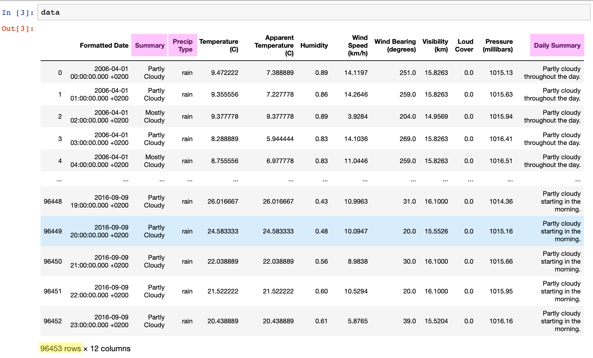
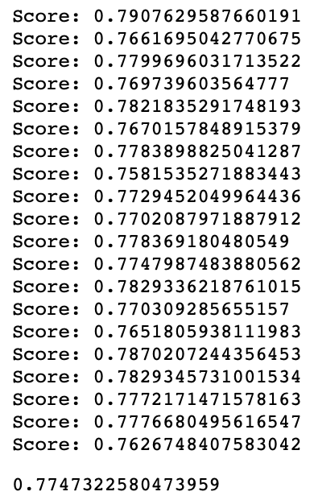
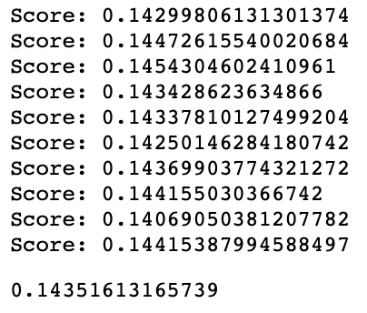
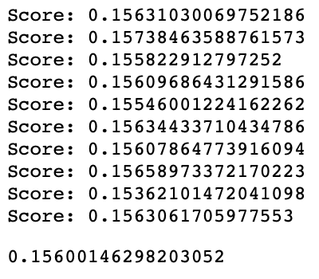
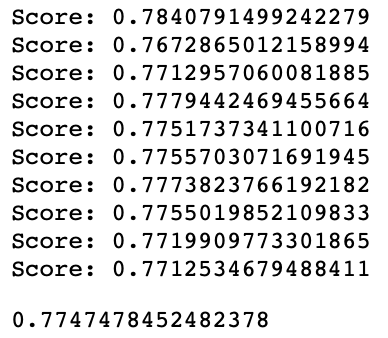
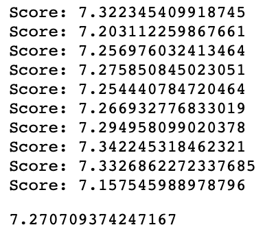
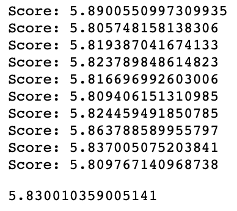
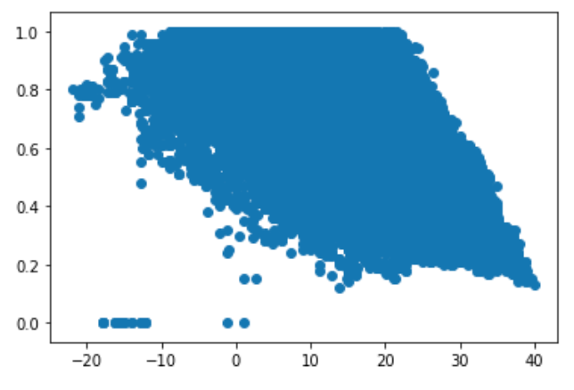

# DATA-310-Midterm-Project

## Question 1/2:

Looking over the variables, I found three of the variables in the imported dataset to be nominal (highlighted in pink). Additionally, I concluded that there were 96453 observations due to the fact that there were 96453 rows in the table (highlighted in yellow).

## Question 3:

    x = data['Temperature (C)']
    x = x.to_numpy().reshape(-1, 1)
    y = data['Humidity']
    y = y.to_numpy().reshape(-1, 1)
    lm = linear_model.LinearRegression()
    model = lm.fit(x, y)
    y_pred = model.predict(x)
    from sklearn.metrics import mean_squared_error as MSE
    rmse = np.sqrt(MSE(y,y_pred))
    
After running the code above, the RMSE variable was equal to 0.1514437964005473.

## Question 4:

    from sklearn.model_selection import KFold # import KFold
    from sklearn.linear_model import Ridge, Lasso, ElasticNet, LinearRegression
    kf = KFold(n_splits=20, random_state=2020,shuffle=True)
    from sklearn.preprocessing import StandardScaler, QuantileTransformer
    scaler = StandardScaler()
    scaler.fit(x)
    x_scale = scaler.fit_transform(x)
    scaler.fit(y)
    y_scale = scaler.fit_transform(y)
    i = 0
    PE = []
    ridge = Ridge(alpha = .1)
    for train_index, test_index in kf.split(x_scale):
        X_train = x_scale[train_index]
        y_train = y_scale[train_index]
        X_test = x_scale[test_index]
        y_test = y_scale[test_index]
        model = ridge.fit(X_train, y_train)
        y_pred = ridge.predict(X_test)
        PE.append(np.sqrt(MSE(y_test, y_pred)))
        print('Score:',np.sqrt(MSE(y_test, y_pred)))

    np.mean(PE)

When I ran the code above, my output was...

Therefore, my answer was 0.774732.

## Question 5:

    x = data['Apparent Temperature (C)']
    x = x.to_numpy().reshape(-1, 1)
    y = data['Humidity']
    kf = KFold(n_splits=10, random_state=1693,shuffle=True)
    from sklearn.ensemble import RandomForestRegressor
    i = 0
    PE = []
    RF_reg = RandomForestRegressor(n_estimators=100,max_depth=50)
    for train_index, test_index in kf.split(x):
        X_train = x[train_index]
        y_train = y[train_index]
        X_test = x[test_index]
        y_test = y[test_index]
        model = RF_reg.fit(X_train, y_train)
        y_pred = RF_reg.predict(X_test)
        PE.append(np.sqrt(MSE(y_test, y_pred)))
        print('Score:',np.sqrt(MSE(y_test, y_pred)))

    np.mean(PE)
    
When I ran the code above, my output was...

Therefore, my answer was 0.143505.

## Question 6:

    x = data['Apparent Temperature (C)']
    x = x.to_numpy().reshape(-1, 1)
    y = data['Humidity']
    from sklearn.preprocessing import PolynomialFeatures
    pf= PolynomialFeatures(degree=6)
    x_poly = pf.fit_transform(x)
    i = 0
    PE = []
    lm = linear_model.LinearRegression()
    for train_index, test_index in kf.split(x):
        X_train = x[train_index]
        y_train = y[train_index]
        X_test = x[test_index]
        y_test = y[test_index]
        model = lm.fit(X_train, y_train)
        y_pred = lm.predict(X_test)
        PE.append(np.sqrt(MSE(y_test, y_pred)))
        print('Score:',np.sqrt(MSE(y_test, y_pred)))

    np.mean(PE)
    
When I ran the code above, my output was...

Therefore, my answer was Incorrect 0.15600.

## Question 7

    x = data['Temperature (C)']
    x = x.to_numpy().reshape(-1, 1)
    y = data['Humidity']
    y = y.to_numpy().reshape(-1, 1)
    kf = KFold(n_splits=10, random_state=1234,shuffle=True)
    i = 0
    PE = []
    ridge = Ridge(alpha = .2)
    scaler = StandardScaler()
    x_scale = scaler.fit_transform(x)
    for train_index, test_index in kf.split(x):
        X_train = scaler.fit_transform(x[train_index])
        y_train = scaler.fit_transform(y[train_index])
        X_test = scaler.fit_transform(x[test_index])
        y_test = scaler.fit_transform(y[test_index])
        model = ridge.fit(X_train, y_train)
        y_pred = ridge.predict(X_test)
        PE.append(np.sqrt(MSE(y_test, y_pred)))
        print('Score:',np.sqrt(MSE(y_test, y_pred)))

    np.mean(PE)
    
When I ran the code above, my output was...

Therefore, my answer was  0.7747.

## Question 8

    y = data['Temperature (C)']
    some_data = [data['Humidity'], data['Wind Speed (km/h)'], data['Pressure (millibars)'], data['Wind Bearing (degrees)']]
    headers = ['Humidity','Wind Speed (km/h)','Pressure (millibars)','Wind Bearing (degrees)']
    xdf = pd.concat(some_data, axis=1, keys=headers)
    kf = KFold(n_splits=10, random_state=1234,shuffle=True)
    pf= PolynomialFeatures(degree=6)
    x_poly = pf.fit_transform(xdf)
    i = 0
    PE = []
    lm = linear_model.LinearRegression()
    for train_index, test_index in kf.split(xdf.values):
        X_train = xdf.values[train_index]
        y_train = y[train_index]
        X_test = xdf.values[test_index]
        y_test = y[test_index]
        model = lm.fit(X_train, y_train)
        y_pred = lm.predict(X_test)
        PE.append(np.sqrt(MSE(y_test, y_pred)))
        print('Score:',np.sqrt(MSE(y_test, y_pred)))

    np.mean(PE)
    
When I ran the code above, my output was...

Therefore, my answer was 7.2707.

## Question 9
    
    y = data['Temperature (C)']
    some_data = [data['Humidity'], data['Wind Speed (km/h)'], data['Pressure (millibars)'], data['Wind Bearing (degrees)']]
    headers = ['Humidity','Wind Speed (km/h)','Pressure (millibars)','Wind Bearing (degrees)']
    xdf = pd.concat(some_data, axis=1, keys=headers)
    kf = KFold(n_splits=10, random_state=1234,shuffle=True)
    i = 0
    PE = []
    RF_reg = RandomForestRegressor(n_estimators=100,max_depth=50)
    for train_index, test_index in kf.split(xdf):
        X_train = xdf.values[train_index]
        y_train = y[train_index]
        X_test = xdf.values[test_index]
        y_test = y[test_index]
        model = RF_reg.fit(X_train, y_train)
        y_pred = RF_reg.predict(X_test)
        PE.append(np.sqrt(MSE(y_test, y_pred)))
        print('Score:',np.sqrt(MSE(y_test, y_pred)))

    np.mean(PE)
    
When I ran the code above, my output was...

Therefore, my answer was 5.8300.

## Question 10:

The following plot shows temperature on the x-axis and humidity on the y-axis. The trend shows that as temperature increases humidity decreases.

